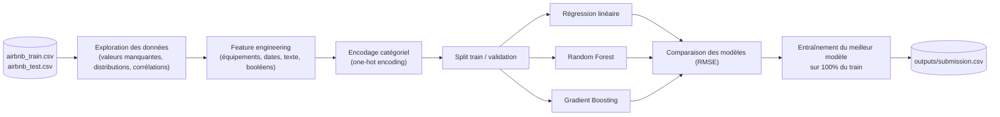
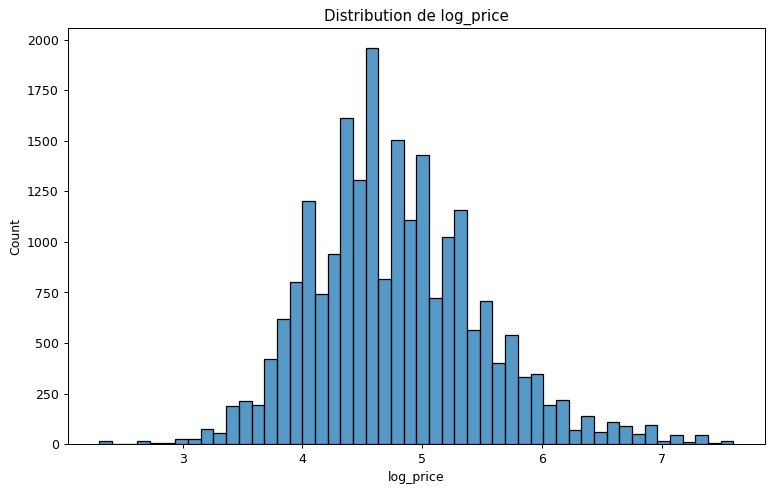
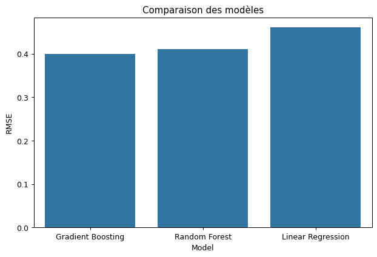
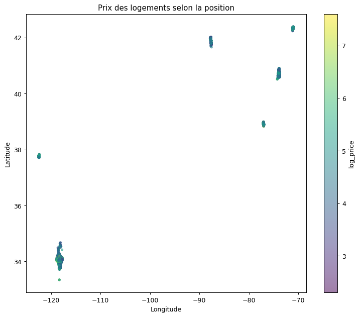
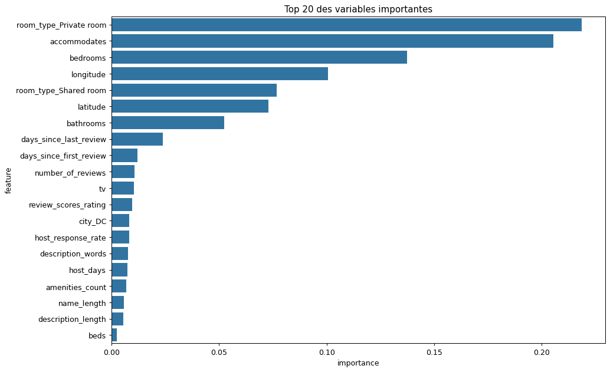

#  Prédiction du prix de logements Airbnb


Projet de machine learning qui prédit le **logarithme du prix** (`log_price`) d'un logement
Airbnb à partir de ses caractéristiques : localisation, type de bien, équipements,
informations sur l'hôte et description textuelle de l'annonce.

## Auteurs

- Youssef Amor
- Abdessamad Ait Haki

## Table des matières

- [Objectif](#objectif)
- [Pipeline](#pipeline)
- [Structure du dépôt](#structure-du-dépôt)
- [Installation](#installation)
- [Utilisation](#utilisation)
- [Résultats](#résultats)
- [Limites et pistes d'amélioration](#limites-et-pistes-damélioration)
- [Licence](#licence)

## Objectif

À partir de 22 234 annonces Airbnb (`data/airbnb_train.csv.gz`) décrites par 27
caractéristiques (type de logement, équipements, note moyenne, localisation, ancienneté de
l'hôte, description textuelle…), le modèle doit prédire le **logarithme du prix** de 51 877
nouvelles annonces (`data/airbnb_test.csv.gz`). Une grande partie du travail consiste à
transformer des variables textuelles et catégorielles brutes en informations exploitables
par un algorithme de machine learning.

## Pipeline



## Structure du dépôt

```
.
├── notebooks/
│   └── AirBnb_analyse_prediction.ipynb   # EDA, feature engineering, modélisation
├── data/
│   ├── airbnb_train.csv.gz
│   ├── airbnb_test.csv.gz
│   ├── prediction_example.csv            # Format de rendu attendu
│   └── README.md                         # Schéma détaillé des colonnes
├── outputs/
│   └── submission.csv                    # Prédictions finales (log_price)
├── assets/                                # Visuels utilisés dans ce README
├── requirements.txt
└── LICENSE
```

## Installation

```bash
git clone <url-de-ce-dépôt>
cd <nom-du-dépôt>

python -m venv .venv
source .venv/bin/activate      # Windows : .venv\Scripts\activate

pip install -r requirements.txt
```

## Utilisation

```bash
jupyter lab notebooks/AirBnb_analyse_prediction.ipynb
```

Le notebook lit directement `data/airbnb_train.csv.gz` et `data/airbnb_test.csv.gz`
(`pandas` décompresse le gzip à la volée) et écrit `outputs/submission.csv` à la fin.
Il fonctionne aussi bien en local qu'importé sur Google Colab.

## Résultats

Trois modèles ont été comparés sur un split train/validation (80 / 20) :

| Modèle | RMSE (validation) |
|---|---|
| Régression linéaire | 0,460 |
| Random Forest | 0,411 |
| **Gradient Boosting** | **0,400** |

Le Gradient Boosting Regressor obtient le meilleur score et est utilisé pour la prédiction
finale. Les variables les plus déterminantes sont le type de chambre (`room_type`), la
capacité d'accueil (`accommodates`), le nombre de chambres (`bedrooms`) et la localisation
(`latitude` / `longitude`).

<p align="center">
  
  
</p>
<p align="center">
  
  
</p>

## Limites et pistes d'amélioration

- **Bug corrigé** : la génération du fichier de soumission utilisait initialement
  `test.index` (un simple numéro de ligne 0, 1, 2…) au lieu du véritable identifiant du
  logement. Le notebook a été corrigé pour utiliser `test['id']`, en cohérence avec
  `data/prediction_example.csv`.
- **Équipements (`amenities`)** : seuls un comptage et la présence de 7 équipements clés
  (Wifi, TV, Kitchen…) sont utilisés. Un encodage plus riche (multi-label binarization sur
  tous les équipements, ou TF-IDF) capturerait davantage d'information.
- **Texte (`description`, `name`)** : seules la longueur et le nombre de mots sont exploités.
  Des embeddings ou un TF-IDF sur le contenu textuel pourraient améliorer les prédictions.
- **Validation** : un simple split 80/20 est utilisé plutôt qu'une validation croisée
  (k-fold), ce qui rend l'estimation du RMSE plus sensible au découpage choisi.
- **Hyperparamètres** : les modèles sont entraînés avec des hyperparamètres fixes (pas de
  recherche systématique via `GridSearchCV` / `RandomizedSearchCV`).
- **Valeurs manquantes** : `review_scores_rating` et `host_response_rate` manquants sont
  remplacés par 0, ce qui peut introduire un biais (0 % de réponse ≠ donnée manquante). Une
  imputation par la médiane ou un indicateur "valeur manquante" serait plus rigoureux.

## Licence

Distribué sous licence [MIT](LICENSE).
